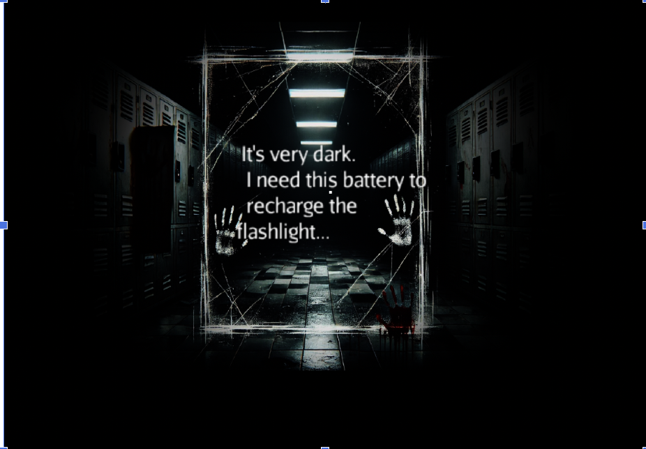
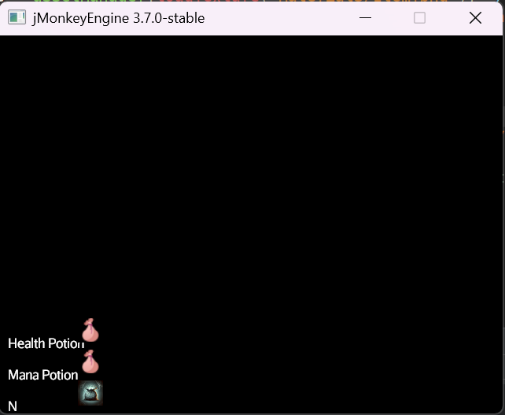

# Perpetuality
Genre: Psychological Horror, Puzzle

## Game Summary
In Perpetuality, players navigate a surreal and unsettling labyrinth within a mysterious university building, representing the fractured psyche of a computer science student. Each level or phase is a different dream or psychological state, mirroring the student's academic pressures, fears, and emotional turmoil. To escape this labyrinth, players must interact with various NPCs, including faculty members, fellow students, and the school mascot. The journey is both a literal and metaphorical exploration of internal struggles, focusing on maintaining sanity amidst an ever-shifting, nightmarish environment.

## Narrative Overview
You play as an unnamed computer science student trapped within the labyrinthine corridors of a university that distorts and manifests their mental state. Each dream phase evokes different aspects of academic life and psychological stress, creating a unique and eerie setting with every progression. The goal is to escape by solving puzzles, interacting with characters, and managing sanity—all while avoiding the malevolent presence of the school mascot, who embodies the student's deepest fears.

## Story Elements
- Protagonist: An unnamed computer science student struggling with the stress and pressures of university life. Their experiences within the labyrinth reflect their internal conflicts and emotional struggles.
- Antagonist: The university's school mascot represents the student's fears and insecurities. It acts as both a guide and a threat, manipulating the labyrinth and the student's perceptions.
- Setting: A university campus that transforms into a surreal and disorienting labyrinth. Familiar locations become distorted, representing the protagonist's mental state.
- Objective: Escape the labyrinth by navigating through various dream phases, interacting with NPCs, solving puzzles, and managing the protagonist's sanity.

## Inspiration
Perpetuality draws inspiration from psychological horror games that emphasize atmosphere, sanity management, and surreal environments:
- Amnesia: The Dark Descent: Influenced our sanity mechanics and atmospheric tension, focusing on maintaining sanity through environmental interactions and evasion rather than combat.
- Shinkansen 0, Exit 8, Platform 8: Inspired our sense of disorientation and anomaly detection mechanics, utilizing repetitive and unsettling environments with the concept of resets upon failure.
- Rusty Lake: Roots: Contributed to our game's eerie atmosphere and dark narrative style, incorporating disturbing imagery and surreal puzzles.

## Gameplay Mechanics
### Sanity Management
- Increasing Sanity: Interact with objects that trigger calming memories, such as notes, photos, or music. Successfully figuring out the puzzle also increases sanity.
- Decreasing Sanity: First, student is not in a safe room (the current saferoom is the bathroom). Second, if student interacts with objects in an incorrect way (or with an incorrect object). Third, if student encounters the monster.

### Progression
- Navigate through multiple dream phases, each representing different psychological states. Different dream phases likely correspond to different scenes.
- Each phase may have unique mechanics affecting the player's sanity level.

### Special Events and Triggers
- Certain events or objects may trigger the appearance of a monster, adding urgency to maintain sanity.
- Lower sanity increases the frequency of these threats (potentially).

### User Interface and Controls
- Sanity Bar: Displayed on-screen, updating in real-time based on player actions and in-game events.
- Interactions: Use standard controls to interact with the environment, items, and NPCs.
- Exploration: Objectives are discovered through exploration and interaction rather than explicit instructions.

**As development progresses, additional mechanics and story elements will be introduced to enhance gameplay depth and narrative cohesion.**

## Development First Deliverable
 ### User Input
    - Maps out the controls of the game
        - WASD: move
        - Left click: interact
        - Right click: inspect
 ### Game Manager
    - Renders the scenes we would want to display in our game
        - Bathroom (Reset, Rest point) 
            - A possible save point for the user to stay in
            - A custom asset that has a light source in the scene
    - Loads in cubes that would soon be interactable objects which would increase or decrease sanity
 ### Objects
    - Interactable cubes
        - Red and Green: collectable
            - They will disappear once you collect them
        - Yellow and Pink:
            - Change color or shape
 

 ### Scene Loader
    - Loads a scene in the game
 ### Game State
    - Keep track of the sanity bar
    - Will keep track if the game is over or not
        - Game will be over when sanity reaches 0
            - So far it would only print game over in the console, need to work on making a game over state
        - 1st iteration: sanity bar implemented, but UI is not implemented yet
 ### Game Control
    - Press using cursor to examine interactable object, selected object will rotate.
    - Clicks on object to interact (object turns gray once interacted), this action 
     will affect sanity value based on the type of object.
    - Green Box as an example of collectable object: disappears upon click 
     (collection)
### Inventory System
    - Inventory that is used to maintain sanity by consuming items
 ### Ways to increase sanity
    - Interacting with objects
        - 1st iteration: interacting with good boxes
    - Standing on a light source
        - 1st iteration: light source implemented, but the sanity bar increasing not implemented
    - Consuming item in the inventory system
 ### Ways to decrease sanity
    - Interacting with objects
        - 1st iteration: interacting with bad boxes
    - Standing in darkness
        - 1st iteration: user will lose sanity by default for now

## Development Second Deliverable
 ### Sanity UI Updated (guidNode)
    - Player can now visualize the live changes in the health bar status
 ### Dialog Box UI (guiNode)
    - Informs the user of what event has occurred and provides guidance on navigation (general instructions + hints on finding items)
        - Triggered by an event system
        - Triggered by consuming an item in the inventory system (working in progress)

 ### Safe Areas
    - Player can now increase their sanity by going into certain safe areas like the Bathroom
    - Bathroom and other safe areas have trigger box that cause sanity to increase
 ### Event System
    - An observer class that handles event that occurs in-game
    - For now, informs the player of their respawn status
    - If an event triggers, a functionality will fire off
        - If the event respawn occurs, the player will respawn in the bathroom
    - This event system will make it easier to add more functionality to our game
        - Easily adding new custom events by adding more functionality in the function trigger events
        - Can easily be used with the Inventory System (working in progress)
 ### Puzzles
    - Not yet certain about what type of puzzles to implement.
        - Currently focused on mechanics that help to make more puzzles (moving, dialog box, flashlight, sanity...)
    - The current core mechanics:
        - Find batteries in the scene & recharge the flashlight
        - Collect certain "key" items to push the plot forward using DialogBox
        - Sanity Management
    
 ### Flashlight (SpotLight + DirectionalLight)
    - The user has a spotlight attached to the camera as the primary light source 
        - Limit the visible range to control the difficulty of finding items
        - The scene should be dark most of the time, flashlight should be the only light source.
    - We will update more mechanics so that the flashlight distance (view range) fluctuates depending on the number of batteries collected (the main collectible). 
        - One of the player's main goals is to continue searching for batteries to maintain flashlight status.
    - Plan: Lower battery status will lead to a quicker decrease in health (sanity) + trigger monster chasing once belows a certain threshold.
 

 ### Animation (Skinning Control + Texture) 
    - There is one animated "monster" in our game, it will chase the user once the battery status is low. 
    - The animated monster is currently using the Oto model, which might change for later submission.
    
 ### More Scene Models Created (AssetManager + Texture)
    - Created two new classroom scenes through Blender.
    - Connected the bathroom scene to the two classroom scenes. 
    - !!IMPORTANT!! Our models are created in Blender with textures already attached, so no need to explicitly use loadTexture method.

 ### Moving Mechanism (Physics)
    - Limit the player's movement (WASD) to the ground level (simulation of gravity) 
    
 ### Inventory System (guiNode)
    - Now has two types of items
        - Key items
            - An item that can possibly be used for puzzles later in our development
            - If a player consumes this item, an event will trigger
        - Consumables 
            - Mostly used to increase or decrease sanity
    - Displays what type of items you have now
        - Updates InventoryUI when an item is gain or used.
  
